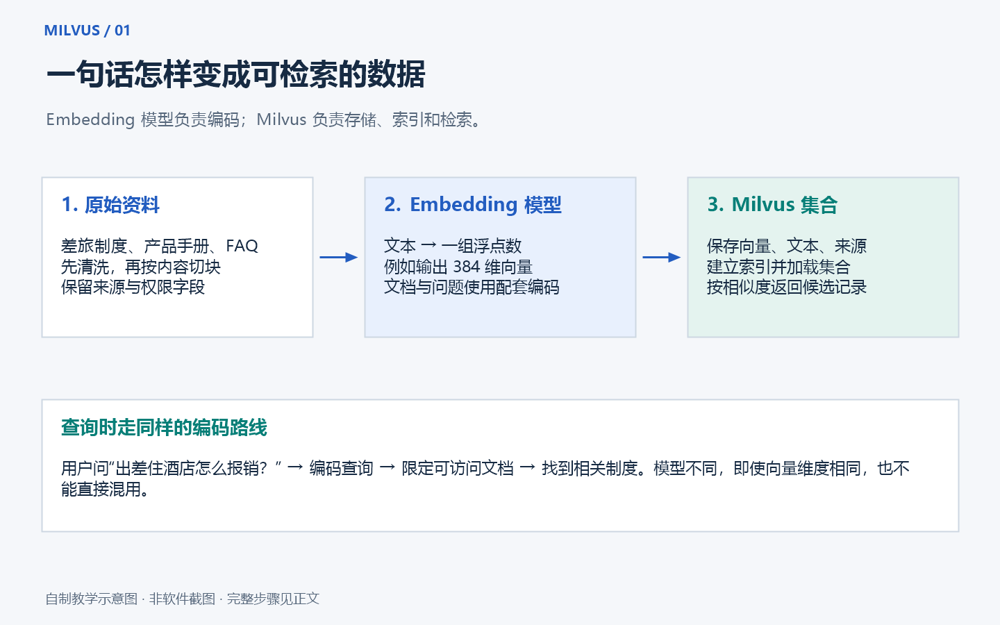

# Milvus 从零到实战：通俗、详细的中文教程

从“向量到底是什么”开始，一步步安装 Milvus，写入数据，进行相似度检索，再搭建一个中文企业 FAQ 语义检索示例。最后学习评测、调优、权限、备份和迁移。

适合准备学习 RAG、企业知识库、AI 应用开发的读者。无需先学线性代数；运行例子需要能打开终端、复制命令，并愿意读懂少量 Python。

**版本基线：Milvus 3.0.1 + PyMilvus 3.0.1；核对日期：2026-09-14。** 这是一套固定版本的学习环境。升级时请一起核对服务器、SDK、管理工具与数据迁移要求。官方默认文档可能已经切换到更新版本。



## 从哪里开始读

1. **[第一章：Milvus 是什么，为什么需要它](docs/01-concepts.md)**：搜索生活例子、向量与 Embedding、相似度、集合与字段、索引与加载、部署模式。
2. **[第二章：安装与第一次连接](docs/02-installation.md)**：Windows/WSL 2、Linux/macOS、Docker Compose、D 盘存储、健康检查、Python 环境、Attu 和常见安装错误。
3. **[第三章：从增删改查到中文语义检索](docs/03-practice.md)**：逐段理解 Python、Schema、向量搜索、过滤、中文模型、FAQ、评测和 RAG 衔接。
4. **[第四章：调优、企业使用与故障排查](docs/04-indexes-and-production.md)**：HNSW/IVF、混合检索、租户权限、一致性、监控、备份、升级、容量估算与练习。
5. **[第五章：资料来源与验证范围](docs/05-sources-and-validation.md)**：固定版本来源、配置改动、已经执行的检查、尚未覆盖的场景。

这是一本分章节的教程，不必一次看完。建议先完成第二章和第三章的基础例子，再回看第一章；掌握查询之后，再读第四章。

## 跟完教程，你会得到什么

- 一套能用 Docker Compose 管理的本地 Milvus Standalone。
- 一个不需要模型、GPU 或 API Key 的三维向量教学例子。
- 一个使用真实多语言 Embedding 模型的中文 FAQ 检索例子。
- 一套带人工相关性标注的微型评测数据，以及 Recall@K、MRR@K 和延迟测量代码。
- 一份能解释“怎么实现、为何如此、如何验证、出了问题怎么办”的学习记录。

中文 FAQ 全部为虚构教学资料，不包含真实企业制度。基础例子中的手工向量用于解释 API，不具备真实语言理解能力。中文语义搜索需要额外下载模型；它不调用收费的大模型 API，也不会自动生成回答。

## 已有 Docker 和 Python：快速体验

完全零基础请先读[安装章节](docs/02-installation.md)。下面命令假定 Docker Desktop/Engine 已启动，当前使用 Linux 容器，且已经安装 Python 和 Git。

### Windows PowerShell

```powershell
# 选择自己的项目目录；下面以 D 盘为例
New-Item -ItemType Directory -Force D:\Projects | Out-Null
Set-Location D:\Projects
git clone https://github.com/zcx3125/milvus-zero-to-pro-guide.git
Set-Location milvus-zero-to-pro-guide

# 先解析配置，再拉镜像、启动服务
docker compose config --quiet
docker compose pull
docker compose up -d --wait --wait-timeout 300
docker compose ps

# 不需要激活脚本，也不需要调整 PowerShell 执行策略
python -m venv .venv
.\.venv\Scripts\python.exe -m pip install -r requirements.txt
.\.venv\Scripts\python.exe examples/01_connect.py
.\.venv\Scripts\python.exe examples/02_crud_search.py
```

`docker compose ps` 中 `standalone`、`etcd`、`minio` 应处于健康状态；连接例子应输出服务版本，基础例子应输出写入和检索结果。不同机器第一次拉取镜像所需时间不同，首次下载不包含在“等服务启动”的 300 秒中。

### Linux / macOS

```bash
git clone https://github.com/zcx3125/milvus-zero-to-pro-guide.git
cd milvus-zero-to-pro-guide
docker compose config --quiet
docker compose pull
docker compose up -d --wait --wait-timeout 300
docker compose ps
python3 -m venv .venv
.venv/bin/python -m pip install -r requirements.txt
.venv/bin/python examples/01_connect.py
.venv/bin/python examples/02_crud_search.py
```

仅把源码放到 D 盘，不会自动把 Docker 镜像、命名卷或模型缓存搬到 D 盘。请看[安装章节的存储说明](docs/02-installation.md)。本仓库不会自动调整你的磁盘位置或安装 Docker。

## 项目里有哪些文件

```text
milvus-zero-to-pro-guide/
├── README.md                     # 学习入口
├── compose.yaml                  # 固定版本、仅本机开放端口
├── requirements.txt              # 基础 SDK 依赖
├── requirements-semantic.txt     # 中文模型的可选依赖
├── .env.example                  # 配置示例，不含个人密钥
├── docs/                         # 五章详细教程
├── examples/                     # 四个分层学习的 Python 例子
│   └── data/                     # 虚构 FAQ 与评测问题
├── tests/                        # 离线检查和需服务的集成测试
├── assets/images/                # 五张自制中文示意图
└── tools/                        # 文档检查与配图生成工具
```

配图在对应章节出现，并标注为示意图；它们不是 Milvus 或 Attu 的真实操作截图。可用浏览器放大查看。图中涉及的选项、地址和参数，正文都有解释。

## 管理界面与日常开关

可选启动 Attu：

```powershell
docker compose --profile ui up -d
```

打开 [本机 Attu](http://127.0.0.1:8000)，按页面指引创建本机管理员。Attu 的登录账户和 Milvus 数据库用户不是同一件事。Attu 容器使用 `standalone:19530` 连接 Milvus；宿主机 Python 使用 `http://127.0.0.1:19530`。

不装 Attu 也可以通过 [Milvus 内置 WebUI](http://127.0.0.1:9091/webui/) 查看运行信息。

暂停学习、释放运行内存：

```powershell
docker compose --profile ui stop
```

继续学习：

```powershell
docker compose up -d --wait --wait-timeout 300
```

需要管理页面时重新执行带 `--profile ui` 的启动命令即可。`stop` 保留容器与命名卷；`down` 删除容器和项目网络，但默认保留命名卷。学习过程中不需要删除卷，`down -v` 会清掉这套项目的持久数据。

## 学习环境的边界

Compose 仅在 `127.0.0.1` 发布数据库和管理端口，MinIO/etcd 不发布到宿主机。为便于入门，使用本地教学凭据，Milvus 尚未启用认证，配置也沿用了官方示例的 `seccomp:unconfined`。它适合个人本机学习；部署到服务器前请完成第四章的身份验证、TLS、网络隔离、凭据替换和恢复验证。

不要把真实 `.env`、企业文档、客户数据、卷目录或模型缓存提交到 GitHub。仓库已忽略常见缓存与环境文件。演示脚本只使用 `milvus_tutorial_` 开头的固定教学集合；清理前仍应核对连接目标。

## 适合怎样展示在求职作品里

完成后，记录你自己的环境、实际执行结果和改进过程。例如：选择一个公开文档集，比较两种切块方式；整理 30～50 个测试问题；解释召回不佳的原因；给出可重复运行的命令。展示真实测量，不把教学数据的分数写成业务准确率。

能回答“为什么漏召回、怎样防止越权、怎样保留数据和恢复服务”，比只放一张聊天界面截图更能体现工程理解。

## 相关学习资料

- [Docker 中文入门教程](https://github.com/zcx3125/docker-zero-to-pro-guide)
- [Git 企业协作教程](https://github.com/zcx3125/git-enterprise-guide)
- [Milvus 官方文档](https://milvus.io/docs)
- [Milvus 3.0.1 官方发布说明](https://github.com/milvus-io/milvus/releases/tag/v3.0.1)

发现步骤不一致或示例错误，可以在本仓库提交 Issue，并附系统版本、镜像版本、命令和脱敏错误信息。完整的验证说明见[第五章](docs/05-sources-and-validation.md)。
