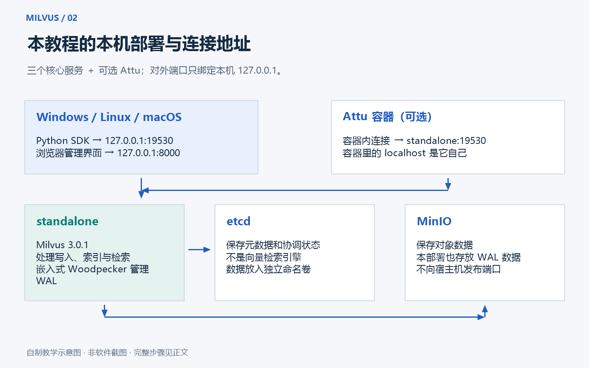

# 02 · 从零安装：在自己的电脑上跑起 Milvus

[返回首页](../README.md) · [先理解基本概念](01-concepts.md)

这一章的目标很具体：在浏览器里看到管理界面，再用 Python 成功连接本机 Milvus。
你不需要先学完 Linux，也不需要购买 GPU 或云服务器。
第一次完成后，电脑上会有一个可以停止、重新启动、保存数据的学习环境。

> 本章是安装操作指南。阅读或下载仓库不会自动安装软件、修改系统，也不会自动启动容器。
> 命令由你在自己的终端中执行；涉及重启、磁盘位置和已有数据时，先读紧接着的说明。

## 1. 先看清楚：我们到底要安装哪些东西

把整套环境想成一个小工作室：

- **Docker Desktop / Docker Engine**：工作室的地基，负责运行容器。
- **Milvus Standalone**：负责保存向量并完成检索的主服务。
- **etcd**：保存集合结构、配置等元数据，类似资料柜的目录。
- **MinIO**：保存 Milvus 使用的对象数据，类似资料柜里的文件。
- **Python + PyMilvus**：你编写程序、向 Milvus 发请求的工具。
- **Attu（可选）**：用鼠标查看集合和数据的管理界面。

你不用分别在 Windows 里安装 etcd 和 MinIO。
仓库中的 [compose.yaml](../compose.yaml) 已经描述了这些容器，Docker 会按配置下载并启动它们。



上图是本教程绘制的部署示意图，用于理解连接关系，不是 Docker Desktop 或 Attu 的实际界面截图。

本教程固定使用 **Milvus 3.0.1、PyMilvus 3.0.1**，可选管理界面为 **Attu 3.0.0**。
固定版本方便复现；本章不把“最新版”当成永远不变的安装条件。
不要只改其中一个版本就假定整套环境仍然兼容。

## 2. 先检查电脑是否适合

Milvus Standalone 的官方 Docker 前置要求列出了 **至少 8 GB 内存，推荐 16 GB**。
这说的是运行环境的资源要求；你的 Windows、浏览器、编辑器也要使用内存。
如果整台电脑只有 8 GB，而且同时开着很多程序，体验可能明显变慢，甚至容器被系统终止。

本教程额外建议：

- 尽量使用 16 GB 或更高内存的电脑。
- 给镜像、容器数据和练习文件预留约 20 GB 可用磁盘空间；这是学习预留量，不是官方固定最低要求。
- 开始实验前关闭暂时不用的大型应用。
- 优先使用 SSD，尤其是后面需要批量插入数据时。
- 本教程的小规模示例不需要 GPU；语义模型在 CPU 上也能执行，但首次加载和计算会慢一些。

Windows 用户还需要确认 CPU 虚拟化已开启。
按 `Ctrl + Shift + Esc` 打开任务管理器，进入“性能 → CPU”，查看“虚拟化”。
显示“已启用”就可以继续；“已禁用”通常需要进入 BIOS/UEFI 设置，具体位置以电脑厂商说明为准。

官方前置要求：[Requirements for Installing Milvus with Docker](https://milvus.io/docs/prerequisite-docker.md)。

## 3. Windows 用户：先准备 WSL 2 和 Docker Desktop

### 3.1 终端是什么，应该打开哪一个

右键 Windows 开始按钮，选择“终端”或“Windows PowerShell”。
本章 Windows 路线中的命令都在 **PowerShell** 中执行。
代码块没有包含 `PS D:\...>` 这样的提示符，你可以直接复制命令。

普通操作不需要管理员终端。
安装 WSL、启用 Windows 功能等系统操作，按照安装器或系统提示使用管理员权限。
不要在浏览器地址栏、Python 的 `>>>` 提示符或 Docker Desktop 搜索框中输入终端命令。

### 3.2 检查 WSL

```powershell
wsl --status
wsl --list --verbose
```

第二条命令如果列出 Linux 发行版，查看 `VERSION` 列是否为 `2`。
没有 Ubuntu 等个人发行版，不一定代表 Docker Desktop 不能工作；Docker Desktop 会维护自己的 WSL 环境。

如果还没有 WSL，请按照微软官方说明，在管理员 PowerShell 中执行：

```powershell
wsl --install
```

安装完成后，按提示重启。
如果系统提示 WSL 内核需要更新，可以执行：

```powershell
wsl --update
```

命令失败时先看具体错误信息，不要反复卸载所有 WSL 发行版。
已有发行版里可能保存着你的其他项目。
Windows 和 WSL 支持范围会变化，请以 [Docker Desktop Windows 安装要求](https://docs.docker.com/desktop/setup/install/windows-install/) 为准。

微软说明：[安装 WSL](https://learn.microsoft.com/windows/wsl/install)。

### 3.3 安装并启动 Docker Desktop

1. 打开 [Docker Desktop 官方下载页面](https://www.docker.com/products/docker-desktop/)。
2. 选择匹配自己电脑操作系统和 CPU 架构的安装包。
3. 按安装器提示安装，Windows 路线优先使用 WSL 2 后端。
4. 安装后启动 Docker Desktop，等待引擎启动完成。
5. 在设置的 `General` 中确认使用 WSL 2 引擎；不同版本界面文案可能略有变化。

Docker Desktop 需要运行 **Linux containers**。
本仓库中的 Milvus、etcd 和 MinIO 都是 Linux 容器，不能放到 Windows containers 模式里运行。
如果托盘菜单显示“Switch to Linux containers”，说明当前需要切换。
如果菜单显示“Switch to Windows containers”，通常已经在 Linux containers 模式。

Docker Desktop 的商业使用许可有适用条件；个人学习与公司采购部署要分别核对官方条款。

### 3.4 确认 Docker 不只是“装了命令”

重新打开一个 PowerShell 窗口，然后运行：

```powershell
docker version
docker compose version
docker info --format '{{.OSType}}'
```

你应该能看到：

- `docker version` 同时有 **Client** 和 **Server** 信息。
- `docker compose version` 能打印 Compose 版本。
- 最后一条命令输出 `linux`。

Client 是负责发指令的客户端，Server 是实际运行容器的引擎。
只有 Client、没有 Server，通常说明 Docker Desktop 未启动、引擎还没准备好，或者连接上下文不正确。
此时继续执行 Milvus 安装命令也不会成功，应先解决 Docker 本身的连接问题。

本章使用带空格的 `docker compose`，不是旧的独立命令 `docker-compose`。

## 4. 想放在 D 盘，先区分两类文件

**项目文件**包括本教程、Python 代码和 `compose.yaml`，可以直接下载到 D 盘。
**Docker 数据**包括下载的镜像和命名卷，通常保存在 Docker 管理的 Linux 磁盘映像中。
这两类文件不一定在同一个盘。

因此，即使你把仓库放到 `D:\AI-Learning\milvus-zero-to-pro-guide`，Docker 仍可能占用 C 盘。
本仓库使用的是命名卷，不是把数据库目录直接绑定到当前项目文件夹。

如果希望 Docker 的大文件也放在 D 盘：

1. 先在 Docker Desktop 的设置里查找 **Resources → Advanced → Disk image location**，或当前版本提供的磁盘位置设置。
2. 按 Docker Desktop 支持的流程选择 D 盘目录并应用设置。
3. 等待迁移和引擎重启完成，再重新运行 `docker version`。
4. 如果当前后端或版本没有该选项，按对应版本的官方说明操作，不要套用其他版本的截图。

不要直接剪切正在使用的 `.vhdx` 文件，也不要为了腾空间卸载或注销已有 Docker WSL 环境。
这些操作可能破坏其他项目的镜像和数据。

资源设置说明：[Docker Desktop settings](https://docs.docker.com/desktop/settings-and-maintenance/settings/)。
如果 Docker 使用 WSL 2 后端，部分资源限制可能由 WSL 管理；不要把 Hyper-V 界面的内存滑块位置当成所有电脑都相同。

## 5. 下载这份教程到 D 盘

### 5.1 已经安装 Git

下面的目录只是学习用示例，可以换成自己的 D 盘目录。
`New-Item -Force` 会确保父目录存在，不会因此清空目录中的文件。

```powershell
New-Item -ItemType Directory -Path 'D:\AI-Learning' -Force
Set-Location 'D:\AI-Learning'
git clone https://github.com/zcx3125/milvus-zero-to-pro-guide.git
Set-Location '.\milvus-zero-to-pro-guide'
Get-ChildItem
```

你应该看到 `compose.yaml`、`README.md`、`examples` 等文件或目录。
如果提示仓库目录已经存在，先查看是否以前下载过；不要为了重新执行命令而删除已有目录。

### 5.2 没有 Git：下载 ZIP 也可以

1. 打开 [本教程 GitHub 仓库](https://github.com/zcx3125/milvus-zero-to-pro-guide)。
2. 点击绿色的 `Code` 按钮，再点击 `Download ZIP`。
3. 将压缩包解压到 D 盘，例如 `D:\AI-Learning`。
4. 进入真正包含 `compose.yaml` 的目录。
5. 在该目录空白处右键打开终端，或在 PowerShell 中用 `Set-Location` 进入它。

ZIP 解压后的默认文件夹可能叫 `milvus-zero-to-pro-guide-main`。
文件夹名字不同没有关系，**后续命令必须在包含 `compose.yaml` 的目录执行**。

## 6. 先读懂配置，再启动

这个仓库的 Compose 项目名固定为 `milvus-tutorial`。
默认会启动三个服务：

- `etcd`：元数据服务，不向宿主机发布端口。
- `minio`：对象存储，不向宿主机发布端口。
- `standalone`：Milvus 主服务。

`attu` 使用 `ui` profile，需要显式启用，因此第一次普通启动不会自动下载和运行它。

主服务发布到本机的地址有两个：

- `127.0.0.1:19530`：Milvus API，用于 Python SDK 和其他客户端连接。
- `127.0.0.1:9091`：健康检查、监控及系统 Web UI 使用的端口。

`127.0.0.1` 表示只允许本机访问。
本地学习配置没有启用 Milvus 身份认证，不要把端口绑定随意改成对整个局域网或公网开放。
MinIO 中的演示凭据也不是生产环境的安全配置。

## 7. 启动 Milvus：按顺序执行这四步

### 7.1 检查配置文件能否被解析

```powershell
docker compose config --quiet
```

正常时可以没有输出，重点是没有错误信息。
如果提示找不到配置文件，先运行 `Get-Location` 和 `Get-ChildItem`，确认当前位置。
如果提示 YAML 错误，检查是否手动改坏了缩进；YAML 不能随意用 Tab 代替空格。

### 7.2 下载镜像

```powershell
docker compose pull
```

第一次需要下载多个镜像，速度取决于网络和镜像仓库访问情况。
看到一层层的进度条是正常现象。
“网页能打开”不代表 `quay.io`、Docker Hub 等镜像仓库也能访问；拉取失败时要看错误对应的仓库地址。
不要用来源不明的脚本自动替换系统网络、证书或全部 Docker 设置。

### 7.3 后台启动

```powershell
docker compose up -d
```

`up` 表示创建或启动这组服务，`-d` 表示在后台运行。
关闭 PowerShell 窗口不会因为这个操作而停止容器，但退出 Docker Desktop 会影响容器运行。
`up -d` 成功返回只代表启动操作已提交，不能立即认定数据库已经可以接受请求。

### 7.4 查看状态和日志

```powershell
docker compose ps
docker compose logs --tail=100 standalone
```

先看到 `etcd` 和 `minio` 变为 `healthy`，随后 `standalone` 完成启动，是正常顺序。
本仓库为 Milvus 健康检查设置了启动宽限时间；机器较慢时请继续观察日志，而不是立刻重复安装。

持续跟踪主服务日志可以运行：

```powershell
docker compose logs -f --tail=100 standalone
```

按 `Ctrl + C` 只是退出日志跟踪，不会停止容器。
如果主服务反复退出，可以同时查看依赖服务日志：

```powershell
docker compose logs --tail=100 etcd minio
```

## 8. 检查“真的能用了”

Windows PowerShell 中使用 `curl.exe`，避免某些版本把 `curl` 当成其他命令的别名：

```powershell
curl.exe --fail http://localhost:9091/healthz
```

健康时应返回成功的 HTTP 响应，常见正文为 `OK`。
连接被拒绝说明端口尚未提供服务；HTTP 失败或健康状态异常，则继续看容器日志。
健康检查成功还不等于你的所有集合和数据都符合预期，后面还需要 SDK 连接和检索测试。

浏览器可打开 [Milvus 系统 Web UI](http://localhost:9091/webui/)。
这是查看系统状态的入口，不要与 Attu 的集合管理界面混淆。
`http://localhost:19530` 是 API 地址，直接在浏览器里打开没有普通首页属于正常现象。

## 9. 可选：安装 Attu 图形管理界面

Milvus 本身已经能工作，Attu 是额外工具。
如果你想先用鼠标查看集合、字段和向量，可以启动仓库自带的 `ui` profile：

```powershell
docker compose --profile ui pull attu
docker compose --profile ui up -d
docker compose --profile ui ps
```

打开浏览器访问 [Attu 管理界面](http://localhost:8000)。
这里的 `8000` 是电脑上的端口，容器内的 Attu 监听 `3000`，所以配置写成 `8000:3000`。

Attu 3.x 首次使用会进入管理员初始化流程，按界面提示建立管理员账号并妥善保存密码。
这个账号用于登录 **Attu**，不等于已经为 Milvus 开启数据库身份认证。
不要照搬旧版 Attu 截图，去寻找当前版本已经改变位置的登录入口。

本配置提供了默认 Milvus 地址 `standalone:19530`。
如果界面需要你创建或检查连接，也应该使用这个容器网络地址。
不要把 Attu 后端的 Milvus 连接地址写成 `localhost:19530`：在 Attu 容器里，`localhost` 指向 Attu 自己。
在你电脑上运行的 Python 则使用 `http://localhost:19530`，两种地址的区别来自程序运行的位置。

Attu 初始化数据保存在 `attu-data` 命名卷中。
本仓库明确提供该数据卷，不应靠随意删除卷来解决忘记密码或连接失败的问题。
版本说明以 [Attu 官方仓库](https://github.com/zilliztech/attu) 和对应版本文档为准。

## 10. 安装 Python：推荐 3.11 或 3.12

本教程建议使用 Python 3.11 或 3.12，便于与 SDK、模型依赖搭配。
不要简单认为系统上最新的 Python 大版本一定已经被所有依赖支持。
也不要把 `pip` 包安装到自己已有的其他项目环境里。

Windows 用户可以从 [Python 官方下载页面](https://www.python.org/downloads/windows/) 获取安装包。
安装后重新打开 PowerShell，检查：

```powershell
py --list
python --version
```

如果 `python` 打开了应用商店，或找不到命令，但 `py --list` 能列出已安装版本，可以用 `py` 启动器。
如果两者都不可用，先解决 Python 安装或 PATH 问题，再进行下一步。

## 11. 在项目里创建独立 Python 环境

确认 PowerShell 仍在本仓库根目录，然后运行：

```powershell
py -3.12 -m venv .venv
.\.venv\Scripts\python.exe -m pip install --upgrade pip
.\.venv\Scripts\python.exe -m pip install -r requirements.txt
```

如果只安装了 Python 3.11，把第一条命令里的 `-3.12` 改为 `-3.11`。
如果没有 `py` 启动器，但 `python --version` 已确认是适用版本，也可以用 `python -m venv .venv`。

`.venv` 是本项目自己的 Python 环境，后面的包会装在这里。
本教程直接调用它里面的 `python.exe`，**无需激活环境，也不需要修改 PowerShell 执行策略**。
这能避开“无法加载 Activate.ps1”一类与 Milvus 无关的问题。

`requirements.txt` 是基础示例依赖；`requirements-semantic.txt` 是真实文本向量示例的额外依赖入口。
先跑通基础连接，再安装较大的语义模型依赖，会更容易定位问题。

## 12. 运行第一个连接测试

在 Milvus 已经健康启动的前提下执行：

```powershell
.\.venv\Scripts\python.exe examples\01_connect.py
```

这个脚本用于验证 SDK 能否连接服务。
第一次运行时集合列表为空是正常的，刚装好的数据库里还没有你的练习数据。
版本 API 可能显示 `3.0-20260902-658cbd1689` 这样的构建标识，不一定与镜像标签 `v3.0.1` 逐字一致；本教程已在真实启动时核对过这种情况。
如果提示无法导入 `pymilvus`，检查是否确实用 `.venv` 中的 Python 安装并执行。
如果提示连接失败，先重新执行健康检查，再看 URI 和端口。

仓库中的 `.env.example` 用来说明示例支持的配置项。
**本仓库的 Python 示例读取进程环境变量，不会自动加载 `.env` 文件。** 默认地址是 `http://127.0.0.1:19530`，本地无认证环境不需要设置 Token。
只有连接地址不同或服务已开启认证时，才需要在运行 Python 的同一个 PowerShell 窗口中设置对应变量，例如：

```powershell
$env:MILVUS_URI = 'http://127.0.0.1:19530'
```

可选的认证变量名是 `MILVUS_TOKEN`；真实值不要写入仓库或截图。
这些设置只影响当前终端及其启动的进程，不会修改 Milvus 服务端的认证配置。
Compose 对 `.env` 的处理也是单独机制，只会在配置引用变量时用于插值；复制文件不会自动改变本仓库写死的版本和端口。
完整变量说明和可选参数见 [示例使用说明](../examples/README.md)。
不要把网上其他项目的环境变量名字原样放进来，然后假定本项目也会识别。

基础连接完成后，继续运行增删改查示例：

```powershell
.\.venv\Scripts\python.exe examples\02_crud_search.py
```

这个阶段先用可控的演示向量理解流程：创建集合、插入记录、建立索引、加载、检索与标量过滤。
演示向量不是经过模型理解后得到的文本语义，不应把这一步的结果当成真实问答效果。
重复执行和清理规则请先阅读示例说明，避免把练习脚本用于已有业务集合。

## 13. 再运行真正的文本语义检索

基础示例成功后，再安装语义检索依赖：

```powershell
.\.venv\Scripts\python.exe -m pip install -r requirements-semantic.txt
.\.venv\Scripts\python.exe examples\03_semantic_search.py
```

首次运行通常需要下载 Embedding 模型，网络不通或模型缓存空间不足会导致这一步失败。
这种失败不代表前面安装的 Milvus 一定有问题。
应把“模型下载失败”和“数据库连接失败”分开排查。

模型会把句子变成固定长度的向量，脚本再把向量交给 Milvus 检索。
后续可以运行 `examples/04_evaluate.py` 学习如何检查检索效果；具体输入、参数和输出以示例说明为准。
不要只看一次结果就宣布模型准确率达到某个百分比。

## 14. 每天怎么开始、暂停和结束

重新开机后，先启动 Docker Desktop，等引擎就绪，再进入项目目录：

```powershell
Set-Location 'D:\AI-Learning\milvus-zero-to-pro-guide'
docker compose up -d
docker compose ps
```

需要 Attu 时，把启动命令换成 `docker compose --profile ui up -d`。
本仓库没有配置开机自启策略，因此不要假定 Windows 开机后 Milvus 一定已经启动。

学习结束，暂时停止所有本项目服务并保留数据：

```powershell
docker compose --profile ui stop
```

下次执行 `up -d` 可重新启动。
如果你希望移除本项目容器和默认网络、保留数据卷，可以执行：

```powershell
docker compose --profile ui down
```

普通 `down` 不会删除本仓库声明的命名卷。
下次重新创建容器，仍会挂载原来的数据卷。

## 15. 数据到底保存在哪里，哪些操作会清空

本项目声明了四个命名卷：

- `etcd-data`：元数据。
- `minio-data`：对象数据。
- `milvus-data`：Milvus 服务使用的持久数据。
- `attu-data`：可选管理界面的持久数据。

由于 Compose 项目名为 `milvus-tutorial`，默认完整卷名形如 `milvus-tutorial_etcd-data`。
如果你通过 `-p` 或相关环境变量更改项目名，实际前缀也会变化。

可以只读查看当前卷：

```powershell
docker volume ls --filter label=com.docker.compose.project=milvus-tutorial
docker volume inspect milvus-tutorial_milvus-data
```

`Mountpoint` 在 Docker Desktop 中通常是 Linux 虚拟环境里的路径，不是让你直接在 Windows 资源管理器里剪切的目录。
复制项目文件夹、上传代码到 GitHub，都不等于备份了这些数据库数据。

**只有准备放弃本项目全部本地练习数据时，才考虑下面这个单独的重置命令。**
它会删除 Compose 管理的项目数据卷，包括集合数据和 Attu 初始化数据；未做备份的数据通常不能恢复。

```powershell
docker compose --profile ui down --volumes
```

不要把它接在每天的启动或停止命令后面。
`docker system prune --volumes` 影响范围更大，不应拿来作为本教程的常规清理步骤。

## 16. Linux / macOS 用户怎么做

macOS 使用支持当前系统和芯片架构的 Docker Desktop。
Linux 可以使用 Docker Engine 和 Compose plugin，不必为了本教程安装完整桌面应用。
先参考 [Docker 官方安装入口](https://docs.docker.com/engine/install/) 完成安装，再确认 `docker version` 有 Client 和 Server。

Linux 上如果出现访问 Docker socket 权限不足，可按安装方式使用 `sudo docker ...` 或按官方说明配置用户权限。
加入 `docker` 用户组基本等同于授予高权限，不应在共享机器上随意开放。
不要为了省事把 `/var/run/docker.sock` 改成任何人都能写。

在 Bash / Zsh 中：

```bash
mkdir -p ~/AI-Learning
cd ~/AI-Learning
git clone https://github.com/zcx3125/milvus-zero-to-pro-guide.git
cd milvus-zero-to-pro-guide
docker compose config --quiet
docker compose pull
docker compose up -d
docker compose ps
curl --fail http://localhost:9091/healthz
```

健康检查要等服务初始化完成后再执行；第一次连接失败可先看日志，再重试。
Python 部分改用 Linux / macOS 的路径：

```bash
python3 --version
python3 -m venv .venv
.venv/bin/python -m pip install --upgrade pip
.venv/bin/python -m pip install -r requirements.txt
.venv/bin/python examples/01_connect.py
.venv/bin/python examples/02_crud_search.py
```

请确认 `python3` 对应建议的 Python 版本。
某些 Linux 发行版需要先安装与系统版本匹配的 `python3-venv` 包，才能创建虚拟环境。
Linux 使用 Docker Engine 时，命名卷存储位置由 Docker 的数据目录决定，不会自动跟随仓库目录。

## 17. Milvus Lite 是什么，为什么这里没有默认选它

Milvus Lite 适合轻量本地试验，可以由 Python 进程使用本地数据库文件。
它能减少独立服务的准备工作，但与 Standalone 在索引、并发、规模和部署方式上存在差异。

官方的 Lite 运行平台以对应版本支持的 Linux / macOS 为准，**不要把 Windows 原生 Python 当成已支持的 Lite 环境**。
Windows 用户可评估 WSL 内的 Linux 环境，但仍要检查 Python 版本、CPU 架构和可用安装包。

本仓库的完整示例围绕 Standalone 和显式索引设计。
不能只把服务 URI 改成一个 `.db` 文件，就宣称所有索引、连接诊断和管理界面步骤都支持 Lite。
如果选择 Lite，请把它作为另一条独立练习路线，并根据官方功能限制调整代码。

官方说明：[Milvus Lite](https://milvus.io/docs/milvus_lite.md)。

## 18. 按错误现象排查，不要一上来重装

- **`docker` 无法识别**：检查安装是否完成、是否重新打开终端，以及 PATH。
- **Client 有版本，Server 连接失败**：检查 Docker Desktop 是否启动、当前 Docker context 是否正确。
- **提示不是 Linux 容器**：切换为 Linux containers，再检查 `docker info`。
- **镜像下载超时**：查看失败的镜像域名，检查该仓库访问和 Docker 的代理配置。
- **`port is already allocated`**：检查 19530、9091 或 8000 是否已被其他程序占用；不要直接终止不认识的进程。
- **容器 `unhealthy` 或反复重启**：查看 `standalone`、`etcd`、`minio` 日志和 Docker 可用内存、磁盘。
- **状态正常，Python 连接失败**：确认脚本运行在哪台电脑或哪个容器里，再确认 URI 和端口。
- **19530 在浏览器没有页面**：它是 API 端口；使用 9091 的系统 Web UI 或 8000 的 Attu。
- **Attu 无法连接**：检查其配置使用 `standalone:19530`，并确认主服务健康。
- **Embedding 模型下载失败**：单独检查模型下载网络和缓存，不要先删除 Milvus 数据卷。
- **C 盘仍然增长**：查看 Docker 磁盘映像位置以及模型、包管理器缓存；项目在 D 盘不代表全部缓存也在 D 盘。

排错时最有用的是错误原文、执行命令、服务状态和最近的日志。
截图可以辅助，但只有“打不开”往往不能区分安装、网络、资源和端口问题。
向他人分享日志前，检查是否包含真实令牌、内部地址或业务数据。

## 19. 完成本章后，应该能确认这些事

- Docker 引擎可用，正在运行 Linux 容器。
- `etcd`、`minio`、`standalone` 状态正常。
- `http://localhost:9091/healthz` 返回健康响应。
- 能用 `.venv` 中的 Python 运行基础连接与检索示例。
- 知道项目文件与 Docker 数据卷是两类不同的数据。
- 知道普通停止保留数据，而删除卷会清空持久数据。
- 如果启用了 Attu，能在 `http://localhost:8000` 完成初始化并连接本机 Milvus。

下一步阅读 [示例使用说明](../examples/README.md)，把“服务启动成功”推进到“理解一次完整的向量检索”。

本章主要参考：[Milvus Docker Compose 安装](https://milvus.io/docs/install_standalone-docker-compose.md)、[Milvus 3.0.1 发布记录](https://github.com/milvus-io/milvus/releases/tag/v3.0.1)、[Docker Compose 入门](https://docs.docker.com/compose/gettingstarted/)。
版本证据、配置改动和实际验证范围见 [来源与验证说明](05-sources-and-validation.md)。
