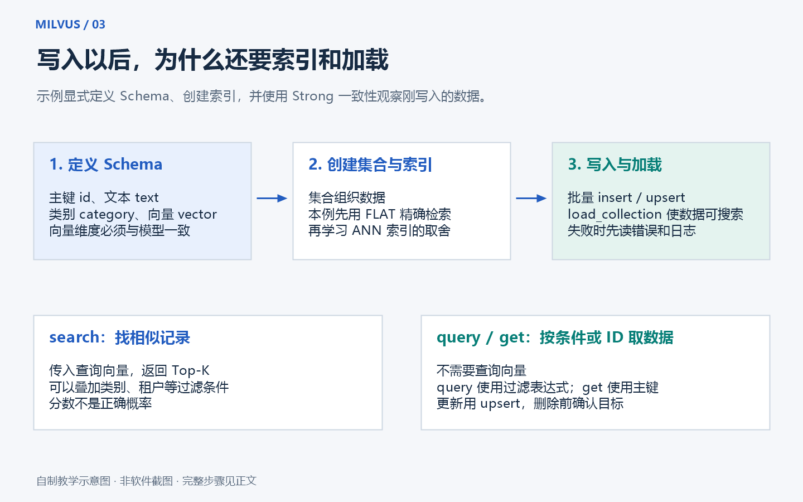
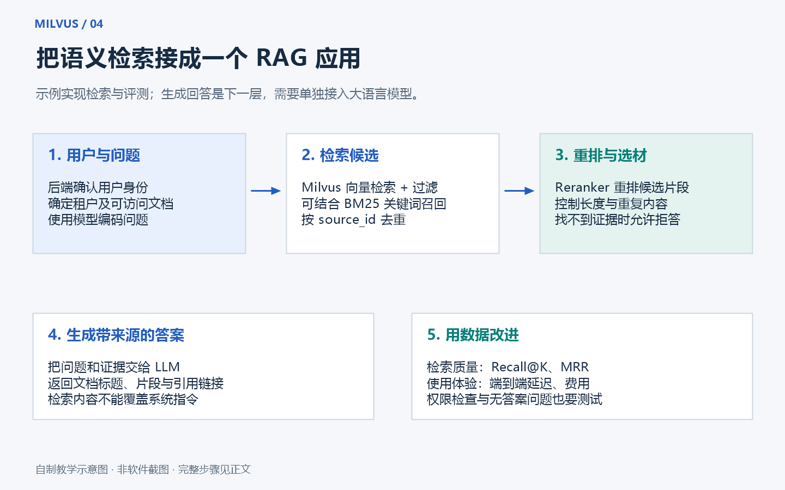

# 第三章：从增删改查到中文语义检索

[上一章：安装与连接](02-installation.md) · [返回首页](../README.md) · [下一章：调优与运维](04-indexes-and-production.md)

这一章不只给出一份“运行完就结束”的程序。我们先看懂每个操作的输入和输出，再把手写向量替换为真实中文文本的向量，最后用一组有参考答案的问题检验检索结果。

## 1. 先约定运行环境和阅读方式

所有完整示例都从仓库根目录运行，例如 `D:\Projects\milvus-zero-to-pro-guide`。Windows 命令使用 `.\.venv\Scripts\python.exe`，省去激活环境和执行策略带来的干扰。Linux/macOS 把这个前缀替换成 `.venv/bin/python` 即可。

正文中的短 Python 片段用于解释原理，依赖前文变量；不必逐段粘贴运行。真正可以直接执行的是仓库里的四个 `.py` 脚本。

运行之前：

```powershell
docker compose ps
.\.venv\Scripts\python.exe examples/01_connect.py
```

确认服务健康、版本匹配。连接检查不会创建或删除任何集合。连接地址默认是 `http://127.0.0.1:19530`。若需要修改，在当前 PowerShell 窗口设置：

```powershell
$env:MILVUS_URI = "http://127.0.0.1:19530"
```

脚本读取进程环境变量。`.env.example` 是格式参考；仅复制成 `.env` 不会自动让这些 Python 脚本加载它。默认的本地教学服务不需要 Token。服务器启用认证后才设置 `MILVUS_TOKEN`，不要将真实密码写入公开代码或截图。

## 2. 最小学习闭环：运行、看结果、对应源代码

```powershell
.\.venv\Scripts\python.exe examples/02_crud_search.py
```

打开[完整源代码](../examples/02_crud_search.py)，按终端中打印的 1～7 步对照阅读。示例使用固定集合 `milvus_tutorial_toy_v1`。

这个集合专供教学，初始记录包含：

- `101`：账号密码相关，属于 `tenant_a`。
- `102`、`103`、`104`：其他主题或相关教学资料，属于 `tenant_a`。
- `901`：属于另一租户 `tenant_b`，其向量与查询向量完全相同。
- `199`：运行期间临时创建、更新和删除的记录，不作为永久演示数据保留。

数字 `901` 是故意设计的测试点：如果不加租户条件，它应该非常相似；加了条件以后，它就不应该出现在甲公司的结果中。这样才能看出过滤条件确实发挥了作用。

这些三维向量是人手编写的。可以把三个坐标暂时理解为“账号、报销、网络”的相关程度，帮助理解距离，但真实模型的一维通常没有这样明确、稳定的人类标签。

**看懂 API 后，就必须换成真实模型来处理任意中文问题。随机数和手写数字不能证明语义检索有效。**



## 3. 第一步：连接服务

核心逻辑是：

```python
from pymilvus import MilvusClient

client = MilvusClient(uri="http://127.0.0.1:19530", timeout=30)
print(client.get_server_version())
print(client.list_collections())
```

`MilvusClient` 是 Python SDK 提供的入口，类似“客户端遥控器”。真正保存数据、建立索引和执行检索的是后台 Milvus 服务。

`timeout=30` 是请求超时设置，不是服务启动时间。服务尚未就绪时增加超时并不能修复端口、认证或进程崩溃问题。

执行完程序后使用 `client.close()` 关闭客户端连接；这不会停止数据库，也不会删除数据。示例使用 `try/finally`，确保程序发生异常时也能关闭连接。

## 4. 第二步：规定一条记录长什么样

例如一条教学记录可以表示为：

```python
{
    "id": 101,
    "vector": [0.95, 0.10, 0.05],
    "text": "忘记密码时，请通过账号自助平台重置密码。",
    "tenant": "tenant_a",
    "category": "account",
    "model": "handwritten-teaching-vector-v1",
}
```

上面的数据是字段结构说明，完整的实际输入以[教学数据文件](../examples/data/toy_vectors.json)为准。

Schema 就是记录的格式约定。本教程显式定义它：

```python
from pymilvus import DataType, MilvusClient

schema = MilvusClient.create_schema(auto_id=False, enable_dynamic_field=False)
schema.add_field(field_name="id", datatype=DataType.INT64, is_primary=True)
schema.add_field(field_name="vector", datatype=DataType.FLOAT_VECTOR, dim=3)
schema.add_field(field_name="text", datatype=DataType.VARCHAR, max_length=4096)
schema.add_field(field_name="tenant", datatype=DataType.VARCHAR, max_length=64)
schema.add_field(field_name="category", datatype=DataType.VARCHAR, max_length=64)
schema.add_field(field_name="model", datatype=DataType.VARCHAR, max_length=256)
```

逐个解释：

- `INT64`：64 位整数；这里作为记录 ID。
- `is_primary=True`：该字段是主键，用来定位记录。
- `auto_id=False`：ID 由程序提供，便于重复运行同一批教学数据。
- `FLOAT_VECTOR`：由浮点数组成的向量。
- `dim=3`：每条向量必须正好包含三个数。不是最多三个，也不是文本长度。
- `VARCHAR`：字符串字段。`max_length` 限制的是 UTF-8 字节数，不等于中文字数。
- `enable_dynamic_field=False`：不接受随意多出来的动态字段，帮助早期发现拼写错误。

真实资料常增加 `document_id`、`chunk_id`、`source_url`、页码、更新时间、模型 revision 和权限标签。这里保留较少字段，便于先看清主线。

`text` 用于查看检索命中的原文。只存向量却不保留原文或可回查的来源，后面很难向用户解释搜到了什么，也难以建立有引用的 RAG。

## 5. 第三步：建立索引并加载集合

```python
index = MilvusClient.prepare_index_params()
index.add_index(
    field_name="vector",
    index_type="FLAT",
    metric_type="COSINE",
)
```

这里选择 `FLAT`：直接比较所有候选向量。它适合几条教学数据，也便于验证确切的排序关系。数据量变大后，这种方式的时间成本可能很高，再考虑 HNSW、IVF 或 AUTOINDEX。

`COSINE` 表示比较向量方向的相似程度。对本例而言，数值越大越相似。它不是百分比，也不是“答案有 98% 概率正确”。

创建与加载的核心调用：

```python
client.create_collection(
    collection_name="milvus_tutorial_toy_v1",
    schema=schema,
    index_params=index,
    consistency_level="Strong",
)
client.load_collection(collection_name="milvus_tutorial_toy_v1")
```

完整脚本额外保存了集合描述标记，并在重跑时检查字段、模型标识与维度。这是为了防止遇到同名但用途不同的集合时直接覆盖数据。不要把上面的解释片段与完整脚本混着创建同名集合。

“加载”是让集合进入可供检索的状态，不等于重新上传数据。`release_collection` 释放检索资源而保留数据；`drop_collection` 删除集合及其数据，含义完全不同。

本例使用 `Strong`，为了在写入、更新、删除后立即查询，看到刚刚执行的操作。实际业务可以在时效与性能之间选择合适的一致性级别，详见第四章。

## 6. 第四步：insert 和 upsert 的区别

新增记录的常见调用是：

```python
client.insert(collection_name=collection, data=rows)
```

不要把重复 `insert` 同一个主键当成关系数据库的自动去重或更新机制。需要按确定主键写入或更新时，使用 `upsert`：

```python
client.upsert(collection_name=collection, data=rows)
```

这就是基础示例默认使用 `upsert` 的原因：第二次运行还是同一组教学 ID，便于复现，而不是每运行一次就生成一批新的随机 ID。

本例使用完整记录进行 `upsert`。不要直接推断为“只传一个字段就一定是局部更新”；部分更新属于需要单独核对版本和 API 的能力。

写入通常应分批，避免一条记录发一次请求，也避免一次请求装入全部大文档。批大小要结合向量维度、文本长度、请求大小限制和客户端内存来决定。

示例不在每次插入后强制 `flush`。写入可见性和持久化机制需要按数据库语义理解，反复 flush 并不是正常高吞吐导入的通用做法。

## 7. 第五步：进行一次向量搜索

```python
hits = client.search(
    collection_name="milvus_tutorial_toy_v1",
    data=[[0.98, 0.08, 0.04]],
    anns_field="vector",
    filter='tenant == "tenant_a"',
    limit=3,
    output_fields=["text", "tenant", "category"],
    search_params={"metric_type": "COSINE", "params": {}},
    consistency_level="Strong",
)
```

重点看下面几个参数：

1. `data` 外层是“这一批问题”，内层才是一个问题的向量。本次只有一个查询，所以结果也是只有一组搜索结果的外层列表。
2. `anns_field` 指明在哪一个向量字段上检索。
3. `filter` 先限定允许参与搜索的数据范围。本例不允许 `tenant_b` 参与甲公司的结果。
4. `limit=3` 是最多返回三条，不保证始终有三条。如果只有一条符合条件，就只能返回一条。
5. `output_fields` 指定额外带回什么字段。不要为每次检索返回不需要的大字段。
6. `search_params` 的度量必须与索引的度量匹配。

每条命中包含主键、相似度值和请求返回的字段。本教程逐条打印它们：

```python
for hit in hits[0]:
    print(hit["id"])
    print(hit["distance"])
    print(hit["entity"]["text"])
```

API 字段叫 `distance`，但这不意味着所有度量都要越小越好：COSINE/IP 通常越大越相似；L2 越小越近。不要在拿到数据后统一反转排序。

## 8. 第六步：搜索叠加普通字段条件

比如“甲公司资料中，仅搜索账号类”：

```python
filter_expression = 'tenant == "tenant_a" and category == "account"'
```

这就是标量过滤与向量搜索结合。租户、分类、版本、文档状态等字段可以帮助限定候选数据。

实际代码中的 `build_filter()` 只接受受限字符集的教学标签，避免把任意用户文本拼接进表达式。真实业务还要从已经验证的用户身份推导租户，不能信任浏览器自己传来的租户 ID。

“搜索时加过滤”也不等于整个系统完成权限控制。按 ID 获取、导出、更新、删除、日志和缓存也必须覆盖同样的访问规则。

现在可以做一个练习：保留租户条件，只改变 `category`，观察结果数量和内容；再读代码确认多加分类条件时没有意外丢掉租户条件。

## 9. 第七步：query 和 get 不需要查询向量

想知道“账号类别有哪些记录”，使用普通条件查询：

```python
rows = client.query(
    collection_name="milvus_tutorial_toy_v1",
    filter='tenant == "tenant_a" and category == "account"',
    output_fields=["id", "text"],
    limit=10,
    consistency_level="Strong",
)
```

已经知道 ID，使用 `get`：

```python
rows = client.get(
    collection_name="milvus_tutorial_toy_v1",
    ids=[101],
    output_fields=["text", "tenant"],
    consistency_level="Strong",
)
```

记住三个问题就不容易混淆：

- “哪些资料与这句话相似？”——`search`。
- “哪些记录符合这个条件？”——`query`。
- “这个 ID 对应什么记录？”——`get`。

`query/get` 的返回顺序不要当成相似度排序，也不要依赖未明确保证的排序规则。

## 10. 第八步：更新、删除与再次验证

基础脚本先插入临时 `199`，再用同一个 ID 更新其 `text`，随后通过 `get` 确认变化，最后执行：

```python
client.delete(collection_name="milvus_tutorial_toy_v1", ids=[199])
```

在 Strong 读取下再查该 ID，应返回空列表。

这个临时记录只用于演示字段更新，所以向量不变。真实业务如果修改了文档语义，应重新生成它的向量，再把文本、向量和版本一同更新；否则显示的是新文本，匹配的却可能还是旧含义。

删除不是“立刻从宿主机磁盘回收所有相关字节”。底层可能通过删除标记、compaction 等过程逐步回收空间，也不意味着已有备份同步消失。法律合规场景应单独设计删除生命周期。

## 11. 第九步：换成真正理解中文相似表达的模型

安装可选依赖：

```powershell
.\.venv\Scripts\python.exe -m pip install -r requirements-semantic.txt
```

然后运行：

```powershell
.\.venv\Scripts\python.exe examples/03_semantic_search.py
.\.venv\Scripts\python.exe examples/03_semantic_search.py --query "出差的钱怎样报销？"
```

本例选择 `sentence-transformers/paraphrase-multilingual-MiniLM-L12-v2`，输出 384 维向量，使用 CPU。它支持多语言，足够帮助理解中文语义搜索的流程；它不是对所有中文企业任务都最优的选择。

首次运行会下载模型，首次安装还会下载 PyTorch 等依赖。这些下载可能比 Python 脚本本身大得多。暂时无法访问 Hugging Face 时，可以先完成不依赖模型的基础例子；Milvus 是否健康和模型下载是否成功是两项检查。

模型加载和编码的关键代码：

```python
from sentence_transformers import SentenceTransformer

model = SentenceTransformer(
    "sentence-transformers/paraphrase-multilingual-MiniLM-L12-v2",
    device="cpu",
)
vectors = model.encode(
    ["申请差旅报销需要上传电子发票。", "忘记密码时使用账号自助平台。"],
    normalize_embeddings=True,
    convert_to_numpy=True,
).tolist()
```

`normalize_embeddings=True` 会将每个向量按长度归一化。本例对文档和问题采用同一模型及同样的编码配置。

有些其他模型要求文档用 `passage:`、问题用 `query:`，或有自己的任务指令。那是具体模型的使用约定，不是所有 Embedding 模型都要照抄的前缀。本例使用的 MiniLM 不需要套用 E5 的编码模板。

脚本分别写入和查询专用集合 `milvus_tutorial_semantic_v1`。它与三维教学集合隔离，避免维度冲突。每条记录保留模型名，创建和重跑时核验模型标识及维度。

当前示例固定了 Python 包版本，但未固定模型下载的 commit revision。要做严格复现实验，应在模型卡确定 revision，在模型加载时显式传入 `revision="已核实的提交 SHA"`，并将 revision 与数据、预处理、依赖环境一起记录；不能只记一个模型名称。

换模型以后，即使仍是 384 维，也应建立新集合、重新编码原文、评测，再切换应用。维度相同不代表向量空间相同。

## 12. FAQ 示例具体做了什么

[FAQ 数据](../examples/data/faq.json)包括密码、差旅报销、VPN、年假、钓鱼邮件、硬件维修等短文，以及一条其他租户的数据。它们是虚构资料，不能作为真实公司的制度使用。

程序流程是：

1. 连接 Milvus，确认可访问。
2. 加载多语言模型。
3. 读取短 FAQ，将每条文本编码为 384 维向量。
4. 校验维度、数值是否合法，创建或核验专用集合。
5. 按确定主键 `upsert` 文本、向量、租户、分类、模型名。
6. 使用同一个模型编码用户问题。
7. 只在 `tenant_a` 中搜索，打印前三条相似原文。

为了降低学习复杂度，每次运行都会对这几条 FAQ 重新编码并写入。在真实应用中，应把“离线导入”和“在线查询”拆开：资料变更时再编码；用户每次提问只编码问题并检索。

如果输入“明天会不会下雨”，系统仍可能给出三条不相关 FAQ，因为 Top-K 搜索的任务是找当前库里最接近的记录。要可靠拒答，需要评测集、合适的阈值/相关性判断，以及上层的无证据处理逻辑。

## 13. 从短 FAQ 走向 PDF、Word 和网页资料

Milvus 不会替你自动理解每一种源文件格式。常见的文档导入链路包括：

1. 使用文件解析器提取文本；扫描版 PDF 需要 OCR。
2. 清理重复页眉页脚、乱码、表格残片与空文本。
3. 按标题、段落或语义拆成片段，保留适量上下文。
4. 为每个片段分配稳定 ID，并记录原文件、章节、页码、权限、版本。
5. 根据模型 tokenizer 的限制控制输入长度，再生成向量。
6. 批量写入，抽查原文与检索结果，处理失败重试与重复导入。

先尝试几百个 token 的片段，再用实际数据评估，不要把某个字符数当成所有模型的标准答案。中文“字数”、UTF-8 字节数和模型 token 数是三种不同的量。

切块太短，可能丢失条件和例外；切块太长，可能包含多个不相关主题，还可能被模型截断。表格和代码适合保留结构；标题有助于理解片段的归属。

正式导入还应处理更新和删除：某个文件换版后，旧片段不能永远留在搜索结果里；重新切块时，不能仅覆盖新增 ID 而遗留旧 ID。

## 14. 判断效果：不要只凭“看着挺像”

先运行语义示例，再执行：

```powershell
.\.venv\Scripts\python.exe examples/04_evaluate.py --k 3
```

[评测数据](../examples/data/evaluation.json)包含六个虚构问题，每个问题标明租户和一个相关 FAQ ID。脚本会展示每题命中的 ID，而不仅是给一个难以解释的总分。

假设某题正确资料是 `202`，返回的是 `[208, 202, 201]`：

- `Recall@1 = 0`：第一条没有正确资料。
- `Recall@3 = 1`：前三条找到了唯一的正确资料。
- `RR@3 = 1/2 = 0.5`：第一个相关结果在第二名。

对所有问题求 RR 的平均，就是 `MRR@K`。正确资料有多个时，Recall 的分母是该题所有相关资料数量。例如应找出两份资料，只找到其中一份，Recall 就是 `1/2`。

这里每题只有一个相关 ID，因此 Recall@K 与 Hit@K 数值相同。它衡量这组问题能不能找到标注资料，不是“近似索引对精确搜索”的 ANN recall，也不是最终回答正确率。

六个样本足够演示计算方式，远不足以宣布“企业级准确率”。真实评测应加入不同说法、拼写错误、术语缩写、困难负例、库中无答案问题、旧文档和跨租户资料。

脚本还分别测量问题编码耗时和检索往返耗时。该耗时不包含模型首次加载、资料建库；可能包含首轮推理与检索的冷启动。它不等于纯 Milvus 内核耗时，也不代表在不同硬件和并发下的性能。

## 15. 从检索接到 RAG，还差哪几步



RAG 可以理解为“先找资料，再让语言模型根据资料回答”。本仓库已实现检索和微型评测，生成层是扩展练习，不会暗中调用模型 API。

可以逐步增加：

1. 将查询放在 FastAPI 等后端，认证用户并注入可信租户条件。
2. 向量检索返回更多候选，再使用 Reranker 重排并去重。
3. 按上下文长度选出少量有用证据，记录引用来源。
4. 把问题与证据交给 LLM，要求根据证据作答、标注来源，证据不足时说明无法确认。
5. 对引用是否支持结论、无答案问题是否拒答、是否泄露跨租户数据进行额外评测。

文档本身也可能包含“忽略上面的规则”一类文字。检索内容应作为不可信数据处理，不能直接变成系统权限或工具调用指令。提示词只是其中一层，后端权限检查和工具边界仍然需要落实。

如果加关键词检索，先了解 BM25；如果加多路检索融合，学习 RRF；如果加重排，记录额外延迟和成本。它们分别解决不同问题，不是换个名字的同一件事。

## 16. 用测试确认自己没有改坏基础行为

```powershell
.\.venv\Scripts\python.exe -m unittest discover -s tests -p "test_*.py" -v
```

离线测试检查向量合法性、余弦排序、过滤输入限制、FAQ 标注关系、Recall/MRR 计算。它们不需要安装或启动 Milvus，也不下载模型。

有真实 Milvus 3.0.1 测试环境时，执行：

```powershell
.\.venv\Scripts\python.exe tests/integration_smoke.py --run
```

这条会写入教学集合，验证搜索首条是 `101`、另一租户被正确排除且其记录仍保留、临时 ID `199` 删除后不再可见、原始记录没有丢失。

集成检查默认不自动执行读写，省略 `--run` 时只提示用法。GitHub Actions 使用临时 Linux runner 启动数据库进行真实检查；详细范围和结果入口见[验证记录](05-sources-and-validation.md)。

## 17. 收尾：保留数据还是清理

平时只要停止容器：

```powershell
docker compose --profile ui stop
```

需要清理某个专用教学集合时，先核对 `MILVUS_URI` 指向自己的练习服务，再选择对应命令：

```powershell
.\.venv\Scripts\python.exe examples/02_crud_search.py --cleanup
```

或：

```powershell
.\.venv\Scripts\python.exe examples/03_semantic_search.py --cleanup
```

清理是单独的操作，不会先重跑示例。脚本会核验教学标记和维度，只删除对应的固定集合。语义清理不下载模型，也不删除模型缓存。不要往这些专用教学集合加入唯一的业务资料。

## 18. 本章自测与延伸练习

完成基础练习后，尝试用自己的话回答：

1. 为什么 Python 包安装成功仍可能连不上 Milvus？
2. 为什么 `data=[[...]]` 有两层列表？
3. 为什么检索结果字段叫 `distance`，COSINE 却是越大越相似？
4. 为什么换了同维度模型仍需重建向量？
5. 为什么真实用户不能任意指定 `tenant`？
6. 为什么更新文档文字时通常也要更新向量？
7. 为什么库里没有答案仍可能返回 Top-3？
8. 为什么离线测试全过仍不能证明数据库已可运行？

进阶练习：把两个 JSON 文件扩充为你自己整理的公开文档与评测问题，提交一次切块或模型改进，写下失败案例、修改理由和测量范围。下一章将进一步介绍索引选择、混合检索和运维。

[返回首页](../README.md) · [下一章：调优、企业使用与故障排查](04-indexes-and-production.md)
