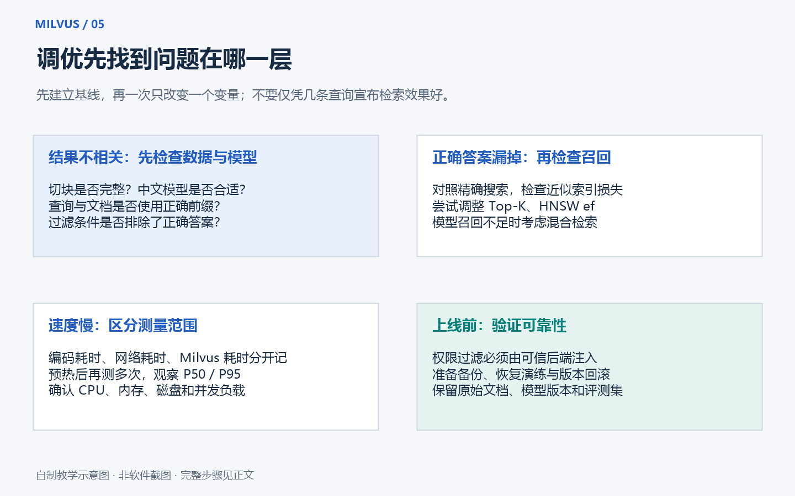

# 第四章：索引、检索质量、性能调优与生产实践

[返回教程首页](../README.md) · [回顾基础概念](01-concepts.md)

> 阅读目标：能解释索引为什么快、如何判断搜索是否有效、数据多了如何估算资源，以及学习演示距离正式服务还差哪些环节。
> 本章的参数是实验起点，不是对所有项目都有效的最优配置。示例数字用于讲解，不是本机性能测试结果。

## 1. 为什么还需要索引

假设集合有 100 万条向量，每条 768 维。
最直接的做法是：每个问题都与 100 万条向量逐一计算距离，再取前几名。
它容易理解，但查询数和数据量增加后，计算开销也会增加。

索引相当于提前整理地图，查询时先定位可能相关的区域，再细查候选。
建地图需要时间和资源，使用地图则可能加快查找。

先认识两个词：

- **精确最近邻检索**：对给定数据和度量，寻找真正排名最靠前的向量。
- **近似最近邻检索，ANN**：为了更快，允许少量遗漏真正最近的向量。

这里的“精确”只描述向量距离的计算结果。
它不意味着返回的资料一定能回答用户问题，语义质量还取决于模型与数据。



## 2. FLAT：逐一比较，适合做基准

FLAT 不使用近似候选筛选来跳过大部分向量，而是进行精确距离比较。
可以把它想象成每本书都看一眼，然后按相关程度排序。

优点是结果容易用来建立距离意义上的基准。
代价是数据规模增大后，搜索成本可能比较高。

适合先考虑 FLAT 的场景：

- 数据很少，主要目的是学习 API。
- 想验证 Embedding 的效果，暂时排除 ANN 遗漏的影响。
- 需要为其他索引建立精确 top-k 参考结果。

做 ANN 对比时，应使用同样的向量、过滤条件和距离度量。
存在并列距离时，还要说明并列结果如何处理，避免仅因 ID 排序不同就算成错误。

## 3. HNSW：像多层道路网络一样找邻居

HNSW 可以理解成多层导航图。
上层先快速靠近目标区域，下层再在附近仔细找。
向量对应图中的点，相邻关系对应点之间的连接。

它常用于希望兼顾较高召回和较低查询延迟的场景。
但维护图结构需要额外内存，构建索引也需要时间。
不要把“常用”理解为“任何数据都比其他索引好”。

### 3.1 `M`：建图时保留多少邻接连接

可以把 `M` 理解成控制道路连接密度的参数。
数值更大，图通常更密，搜索有更多可走的路径。
代价往往是更多索引内存和构建开销。

`M` 是索引构建参数。
如果已经构建好索引，单纯修改某一次搜索请求里的参数不会重新改变图结构。
需要更换构建配置时，应安排重建与服务切换。

### 3.2 `efConstruction`：建图时多认真地挑选邻居

它控制构建阶段考虑候选邻居的规模。
更大的值通常有机会建立质量更好的图，但构建更慢、构建资源开销也可能更高。

一个容易混淆的点：它不等于最终每个节点保留的连接数量。
候选看得更多，不代表把所有候选都连接起来。

### 3.3 `ef`：搜索时愿意多找多少候选

`ef` 是查询参数，用来控制搜索广度。
它变大，通常有机会减少遗漏，但查询计算和延迟也可能增加。

实验时可以先固定图结构，再试 `ef=32、64、128`。
对 HNSW，实验值至少覆盖需要返回的 `top_k`，并核对当前版本要求。
不要把 `ef` 简化成“数据库必定只计算这么多条记录”的精确计数器。

### 3.4 构建参数和查询参数要放在不同位置

下面是说明参数位置的片段。
前提是你已通过 `MilvusClient` 建立 `client`，目标集合具有名为 `vector` 的浮点向量字段，并且该字段尚未创建待替换的索引。
首次入门请先运行第三章的完整示例，不要把这段直接贴进已有业务集合。

```python
index_params = client.prepare_index_params()
index_params.add_index(
    field_name="vector",
    index_name="vector_hnsw",
    index_type="HNSW",
    metric_type="COSINE",
    params={"M": 16, "efConstruction": 200},
)

client.create_index(
    collection_name="my_hnsw_experiment",
    index_params=index_params,
)
client.load_collection(collection_name="my_hnsw_experiment")

# query_vector 必须来自与入库文本兼容的模型，维度要与 Schema 一致。
result = client.search(
    collection_name="my_hnsw_experiment",
    anns_field="vector",
    data=[query_vector],
    limit=5,
    search_params={"metric_type": "COSINE", "params": {"ef": 64}},
    output_fields=["text"],
)
```

`M=16`、`efConstruction=200`、`ef=64` 是便于理解的一组实验值。
它们没有被本教程宣称为最佳生产参数。

## 4. IVF_FLAT：先把向量分桶，再搜索部分桶

IVF_FLAT 会根据向量分布做聚类，把向量组织到若干候选区域。
搜索时先找可能相关的区域，再在选中的区域里做距离比较。

这里的“桶”是索引内部的聚类，不是 Collection 的 Partition。
FLAT 部分表示桶内保存未经该索引量化压缩的原始向量表示。
其他 IVF 变体可能引入压缩，准确性与资源特点会不同。

### 4.1 `nlist`：构建时分成多少个桶

`nlist` 是索引构建参数。
桶太少，搜索某个桶时可能要比较很多向量。
桶更多会改变聚类粒度，但也带来聚类与管理开销。

不能只增大 `nlist` 就保证召回更好。
如果桶变多了，查询却仍只检查很少的桶，也可能更容易遗漏结果。
因此必须结合 `nprobe` 评测。

### 4.2 `nprobe`：查询时检查多少个桶

`nprobe` 是查询参数。
它的值需要在当前索引允许范围内，通常不超过 `nlist`。

例如建索引用 `nlist=128`，查询分别试 `nprobe=4、8、16、32`。
搜索更多桶通常能提高找到真实近邻的机会，也会增加计算量。

### 4.3 小样本不适合盲目设置很多桶

只有几条数据，却设置上千个聚类中心，不是合理的学习实验。
IVF 聚类需要足够数据，Milvus 又会按内部数据段组织索引。
因此不要仅按整个集合总量生搬硬套网上的某个 `nlist` 公式。

先用足够规模的测试数据验证索引能正确构建，再开展参数对比。

## 5. AUTOINDEX：先交给系统选择，再做业务评测

AUTOINDEX 是让系统管理索引选择或相关配置的入口。
它适合先跑通应用，减少一开始就面对很多索引参数的负担。

具体实现可能随开源版本、托管服务和产品配置变化。
不要断言 AUTOINDEX 永远等于某一种固定的 HNSW 参数。
也不要把 HNSW 专属参数直接复制到所有 AUTOINDEX 搜索里。

如果目标是学习算法差异，建立独立实验集合并显式选择 FLAT、HNSW、IVF_FLAT 更清楚。
如果目标是尽快交付业务原型，先用支持的默认配置，再观察效果和资源使用。

## 6. COSINE、IP、L2：相似分数到底怎么看

返回字段有时叫 `distance`，但这不意味着所有度量都是“越小越好”。
必须同时知道使用的 `metric_type`。

### 6.1 COSINE：看方向有多接近，通常越大越相似

余弦相似度主要关注两个向量的方向。
对于非零向量，数学范围是 `[-1, 1]`，计算浮点误差可能带来极小偏差。
接近 1 表示方向接近。

例如 `[1, 0]` 和 `[2, 0]` 的方向相同，余弦相似度为 1。
它们长度不同，但方向一致。

零向量的余弦在数学上没有定义。
入库前应发现全零或非法向量，不要依赖某个库碰巧返回的数值行为。

### 6.2 IP：内积，越大排得越靠前

内积把对应位置相乘后相加。
例如 `[1, 2]` 和 `[3, 4]` 的内积是 `1×3 + 2×4 = 11`。

它同时受方向和向量长度影响。
未归一化向量的内积并不保证在 `[-1, 1]` 范围内。
如果把两边都归一化为单位长度，内积才与余弦相似度一致。

是否归一化，要遵循 Embedding 模型和业务设计。
有些模型或任务希望保留长度信息，不能机械地认为所有场景都应手动归一化。

### 6.3 L2：看距离有多远，越小越接近

L2 可以先理解成几何距离。
Milvus 的 L2 返回计算省略了最终开平方，即平方欧氏距离；排序方向不变。

例如 `[0, 0]` 到 `[3, 4]` 的普通欧氏距离是 5，而平方距离是 25。
与自己比较的 L2 距离为 0。

如果两边都归一化为单位向量，则平方 L2 满足 `L2² = 2 - 2 × COSINE`。
这时它们的排序关系具有对应性，但返回数值与阈值仍不能直接混用。

### 6.4 为什么不能统一规定“超过 0.8 就是正确答案”

分数不是事实正确率，也不是模型给出的概率。
不同模型、数据、度量、切分方式会产生不同分数分布。
BM25、余弦和重排序模型的分数更不是同一单位。

应在自己标注的问题集上选择阈值，并同时观察误答与拒答。
换模型或换切分策略后，要重新验证阈值。

## 7. 检索效果不好，先判断是哪一层出了问题

可以按下面的顺序排查：

1. 原文里是否真的存在问题所需答案？
2. 文本提取是否正确，扫描件是否做了 OCR？
3. 答案是否被切分成互相分离、缺少上下文的片段？
4. 文档与问题是否使用兼容的模型、维度和编码前缀？
5. 权限或分类过滤是否错误地排除了正确资料？
6. 用精确检索时，相关资料能否排到前面？
7. 如果精确检索可以而 ANN 不行，再检查索引和查询参数。
8. 如果候选资料正确但最终回答错误，再检查提示词、上下文与生成模型。

这个顺序能避免把所有问题都归咎于数据库。
提高 `ef` 不能找回根本没有导入的文档，也不能修复错误的 OCR。

## 8. ANN 召回与业务相关性是两种不同评测

### 8.1 ANN Recall@k：近似索引找回了多少真正最近邻

固定同一批向量、查询、过滤条件和度量，用精确检索得到前 `k` 个 ID。
然后与 ANN 的前 `k` 个 ID 对比。

```text
精确 top-5：A、B、C、D、E
ANN top-5： A、B、C、D、X

ANN Recall@5 = 两组共有的 ID 数 / 5 = 4 / 5 = 0.8
```

多条查询分别计算后再求平均。
如果某次过滤后不足 `k` 条，分母和统计方式要在评测报告中明确，不能混着计算。

这衡量索引有没有遗漏真正近邻。
如果 Embedding 本身把错误资料排在前面，ANN 完美复现这些结果，ANN Recall 仍然可能很高。

### 8.2 业务 Recall@k：相关资料找回了多少

需要人工或可靠规则标注某个问题有哪些相关资料。
假设某个问题有 4 条标注相关片段，检索前 5 条中包含其中 3 条：

```text
业务 Recall@5 = 找回的相关片段数 / 全部标注相关片段数
              = 3 / 4 = 0.75
```

它的分母不是固定的 5。
如果标注不完整，就不能把数字当作完整真实相关集合上的召回率。
报告应说明标注范围，以及评测单位是“文档”还是“片段”。

### 8.3 Hit@k：前 k 条里有没有至少一个相关结果

对单个问题，有至少一个相关结果就记 1，没有就记 0。
对所有问题求平均，就是整体 Hit@k。

例如 20 个有可回答资料的问题，17 个在前 5 条中找到了至少一个相关片段：

```text
Hit@5 = 17 / 20 = 0.85
```

它易于理解，但不关心是否遗漏了其他必要证据。
需要多条资料联合回答的业务，不能只看 Hit@k。

### 8.4 MRR：第一个相关结果排得够不够前

先找到每个问题的第一个相关结果排名 `r`，计算 `1/r`。
所有问题求平均，就是 MRR。
没有相关结果的查询记 0。

```text
问题 1：第一个相关结果排第 1，得分 1
问题 2：第一个相关结果排第 2，得分 0.5
问题 3：检查范围内没有相关结果，得分 0

MRR = (1 + 0.5 + 0) / 3 = 0.5
```

如果只检查前 `k` 个结果，应报告为 MRR@k，并把范围外命中按规则记 0。
不要在不同实验中悄悄改变检查深度。

### 8.5 还要看延迟、吞吐和成本

- **P50 延迟**：一半请求能在这个时间内完成。
- **P95 延迟**：95% 的请求能在这个时间内完成，能看出多数较慢请求的体验。
- **P99 延迟**：更关注长尾慢请求。
- **QPS**：每秒查询数，要同时记录并发与错误率。
- **成本**：Embedding、数据库资源、重排序和生成都可能产生成本。

数据库搜索耗时和用户感受到的总响应时间不是同一个数字。
一次 RAG 回答还包括网络、问题 Embedding、检索、重排序和模型生成。

## 9. 如何做一组可信的调优实验

### 9.1 固定对比条件

保存一份可公开或可合规使用的固定数据集。
记录数据条数、维度、模型名称和版本、分段方式、过滤比例、硬件与 Milvus 版本。
避免拿不同数据和不同机器跑出的数字硬比。

### 9.2 先建两个基线

第一个基线是精确检索，用于判断 ANN 遗漏。
第二个基线是人工标注相关性，用于判断业务是否真正有用。
它们回答不同问题，应分别保存结果。

### 9.3 一次只改变一个主要因素

例如先固定 `M` 与 `efConstruction`，只逐步增大 `ef`。
记录 ANN Recall@10、业务 Hit@5、P95 延迟、内存和错误率。
再根据结果决定是否值得改变建图参数。

不要一次同时更换模型、切分、索引和服务器规格，最后却无法解释是谁带来了改善。

### 9.4 区分冷启动与预热后性能

集合刚加载、缓存为空时，表现可能与稳定运行时不同。
报告要说明是否预热、重复次数、并发模式和数据是否全部装载就绪。
只展示最快一次请求容易误导。

### 9.5 为“库里没有答案”的问题单独测试

准备一组明确没有答案的问题。
测量系统是否能拒答，以及把无关资料当成答案依据的比例。
这部分不能简单并入“存在相关资料”的召回率分母。

## 10. 文档切分：数据质量往往比调参数更早影响效果

### 10.1 为什么要切分

把几万字手册压成一个向量，可能掩盖其中某个细节问题。
把句子切得过碎，又可能丢失条件、适用范围和上文标题。

切分的目标是让每段尽量表达一个完整意思，同时保留追溯来源的能力。

### 10.2 一个可开始实验的办法

1. 先按标题、段落和列表项理解文档结构。
2. 对太长的段落再分割，避免在关键句中间硬切。
3. 按模型的 Token 长度限制控制片段；Token 不等于汉字，也不等于英文单词。
4. 可先比较几个几百 Token 级别的片段长度，再观察效果。
5. 对跨段内容加入少量重叠，但记录额外存储与重复候选成本。
6. 保存文档 ID、片段序号、标题、来源链接、更新时间与权限属性。

这里没有一个适合所有资料的固定数字。
代码、表格、法规条文和闲聊记录，适合的分段策略可能完全不同。

### 10.3 返回结果时补全必要上下文

检索命中片段后，可以按业务需要补充相邻段落或父章节。
同时控制最终上下文长度，避免把整本手册重新塞给模型。
去重时既要处理重复文本，也要考虑同一文档的多个近邻片段是否挤占了候选名额。

## 11. 过滤与权限：用户能看到什么，要在服务端决定

### 11.1 普通过滤解决业务范围问题

例如只搜索 IT 部门、当前有效、某种语言的资料。
向量负责“像不像”，过滤负责“是否属于允许的候选范围”。

过滤条件不是生成模型的自然语言建议，而是数据库查询约束。
“请不要回答其他部门资料”不能替代真正的访问控制。

### 11.2 多租户时，不信任浏览器直接传来的租户 ID

应用应根据已经验证的登录身份确定 `tenant_id`。
用户修改请求里的租户 ID，不应改变服务端授权范围。

对于查询、按 ID 获取、删除、混合检索、导出等入口，都要检查相应权限。
只保护聊天界面，留下未保护的数据接口，仍然可能泄露资料。

### 11.3 不要先全库召回，再让大模型过滤机密资料

那样机密内容可能已经进入日志、重排序服务或模型上下文。
候选检索阶段就应施加权限限制，并在资料输出边界再次校验。

如果使用多路混合检索，每一路都必须遵循相同的授权边界。
缓存键也要包含影响访问范围的信息，防止把甲公司的搜索结果复用给乙公司。

### 11.4 数据库权限与业务文档权限是不同层次

数据库的用户和角色管理限制“哪个系统账号可以操作哪些资源”。
业务 ACL 限制“某个业务用户能读哪些文档”。
根据隔离要求，可以选择独立集合、数据库、实例或受控过滤等方案。
不能默认一个 `tenant_id` 字段就完成了所有安全隔离。

## 12. BM25、混合搜索、RRF 和 Reranker

### 12.1 为什么向量搜索还要搭配 BM25

向量搜索擅长发现意思接近的描述。
BM25 常有助于查找准确的型号、缩写、错误码和专有词。
把两种方法结合，可以覆盖更多问题表达方式。

Milvus 的全文搜索能力可以配置文本分析和 BM25 相关函数，把文本转换为可检索的稀疏表示。
这不意味着给普通字符串字段加上 `BM25` 名字就能工作。
需要按版本文档配置文本字段、Analyzer、函数输出的稀疏字段和对应索引。

中文业务要检查分词器、领域词语和中英文混合内容。
分词不合理时，关键词检索也会受到影响。

### 12.2 Dense 与 Sparse 分别是什么意思

Dense，即稠密向量，通常是很多位置都有数值的模型表示。
Sparse，即稀疏向量，通常只有部分位置有非零值，便于表示词项等稀疏特征。

不是所有 Sparse 向量都来自 BM25。
有的稀疏表示来自学习模型，具体度量和建索引方式要与生成方法匹配。

### 12.3 混合搜索需要把多路候选合并

例如向量检索取 30 条，BM25 取 30 条，再合并去重。
这里的 30 只是实验示例，实际要观察候选覆盖、重排序成本和延迟。

不能直接把原始 BM25 分数与 COSINE 分数相加。
两种分数的尺度和含义不一致。
如使用带归一化的加权方法，也要说明规则并评测权重。

### 12.4 RRF：根据名次融合，减少分数尺度困扰

RRF 是 Reciprocal Rank Fusion，倒数排名融合。
它按每一路的排名给候选加分，而不是直接比较原始分数。

```text
某候选的融合分数 = 各检索路的 1 / (c + 该路名次) 之和
```

名次一般从 1 开始；候选没有出现在某路候选中，那一路不给贡献。
`c` 是控制排名差异影响的常数，不是返回条数 `top_k`。
Milvus 的 `RRFRanker` 参数命名和允许范围以当前 SDK 文档为准。

RRF 只是融合排序方法。
它不会阅读问题和文章来判断真正的语义相关性，也不能恢复所有未进入任何一路候选的资料。

### 12.5 Reranker：再仔细比较问题与候选文本

重排序模型通常把“问题 + 某段候选文本”一起处理，给出更细的相关性评分。
它比向量距离更有机会理解细节，但一般更慢、更贵。

常见流程是先便宜地找几十条候选，再重排，最后给生成模型少量高质量片段。
候选数量、文本长度和模型选择都应通过业务问题集评测。
不能为了“加上 Reranker”而忽略最初候选召回是否足够。

### 12.6 逐步实现更容易知道改进来自哪里

第一版：稠密向量检索，正确展示原文和来源。
第二版：加入标注问题集，形成业务相关性基线。
第三版：加入关键词检索与 RRF，观察错误码和专有词问题。
第四版：加入 Reranker，测量质量提升与额外延迟。
第五版：接入回答生成，测量引用准确性、拒答与端到端成本。

这些是可逐步扩展的练习方向，不表示仓库已经完成所有生产级混合检索功能。

## 13. 一致性：刚写入的数据为什么暂时搜不到

### 13.1 写入成功与各查询节点立即可见不是一个概念

Milvus 在不同服务之间协调数据处理与读取进度。
一致性级别决定读取时对最新数据可见性的要求。
它与 ANN 召回率是两个不同问题：一个关于“看到了哪一时刻的数据”，一个关于“是否找全了这些数据里的近邻”。

### 13.2 常见一致性级别

- `Strong`：读取时要求满足更强的新数据可见性保证，可能需要等待相应处理进度。
- `Bounded`：允许受限的数据陈旧程度，官方文档中是默认级别。
- `Session`：保证相应客户端会话能读到自身写入范围内的数据；不能把它当作跨所有独立客户端的全局保证。
- `Eventually`：允许较旧的数据视图，适合能接受延迟可见的场景。

入门脚本中，插入后马上演示查询，使用明确的一致性设置更容易理解结果。
正式系统则根据新鲜度要求、延迟和可用性来选择。

### 13.3 `flush()` 不是“搜不到就调用”的万能按钮

Flush 涉及把相关数据段封存、持久化并推动后续处理。
它不是每条记录插入后的必需动作，也不能替代合适的一致性设置。

频繁强制 Flush 可能制造很多小数据段，带来索引和查询管理开销。
需要明确持久化操作边界、批量导入结束检查或备份流程时，再按当前文档使用。

数据更新和删除后的空间回收可能由后台整理逐步完成。
因此删了记录，磁盘空间没有立刻同比例减少，并不自动意味着删除失败。
不要据此直接删除对象存储里的内部文件。

## 14. 数据量变大，怎么估算资源

### 14.1 先算 FLOAT32 原始向量的大小

每个 FLOAT32 数值通常是 4 字节。
有 `N` 条向量、每条 `d` 维，原始向量约为：

```text
原始向量字节数 = N × d × 4

100 万条 × 768 维 × 4 字节
= 3,072,000,000 字节
≈ 3.072 GB，或 2.86 GiB
```

`GB` 使用十进制，`GiB` 使用二进制，所以数字不同。
1000 万条同样维度的 FLOAT32 原始向量约 30.72 GB，即 28.61 GiB。

### 14.2 这不是整台服务器的内存需求

还需要考虑：

- 向量索引，例如 HNSW 图连接。
- 主键、文本、JSON、权限字段及其索引。
- 日志、元数据和正在写入的数据。
- 查询缓存、并发请求、返回结果与服务进程。
- 副本、索引构建、数据压缩整理和迁移峰值。
- 操作系统、etcd、对象存储及监控服务。

磁盘需求、对象存储需求和查询节点内存需求也不是同一个数。
索引类型、压缩、mmap、缓存和副本配置都会改变资源分布。
因此不能拿 `N × d × 4` 算出 3 GB，就断言一台 4 GB 机器够用。

### 14.3 多向量、多模型和切分都会放大数据规模

同一篇文档切成 20 段，就通常对应 20 条向量记录。
每段保存两种不同模型的向量，又会增加相应存储。
大量重叠切分、重复导入和历史版本保留也会扩大集合。

容量规划应从“总片段数”而不是“PDF 文件数”开始。

### 14.4 学习电脑与生产服务器的判断不同

学习时先用小样本，观察 Docker 与 WSL 的实际内存占用。
原始资料、Docker 镜像、数据卷和模型缓存可能分布在不同磁盘位置。
把项目放到 D 盘不代表 Docker 的全部数据自动也在 D 盘，安装章节会说明相关路径。

生产则需要接近真实规模的压测，并为增长和故障留余量。
没有工作负载数据时，无法负责任地保证某个固定机器规格一定够用。

## 15. 备份：能恢复的数据才算有用的备份

### 15.1 先说清楚恢复目标

RPO 是可接受丢失多久的数据。
例如 RPO 为 1 小时，表示最坏情况下允许损失最近约 1 小时的变化。

RTO 是可接受多久恢复服务。
例如 RTO 为 2 小时，表示需要在约 2 小时内恢复到约定可用状态。

备份频率、存储位置和恢复流程都应围绕这些目标设计。

### 15.2 不要把复制一个 Docker 卷当成完整备份方案

Milvus 的元数据、对象数据和 WAL 之间存在关联。
运行时分别复制几个目录，得到的时间点可能不一致。
不能因为压缩包生成成功，就认为一定可以恢复。

也不要把 `docker compose down -v` 当成普通重启命令。
`-v` 会影响 Compose 管理的数据卷；在有数据的环境中可能造成数据丢失。

### 15.3 Milvus Backup 是官方生态中的备份工具

Milvus Backup 可以根据集合元数据与数据段进行备份和恢复。
工具版本与源、目标 Milvus 版本的兼容性必须单独确认。

本教程核对的 `v3.0.x` 文档源码中，备份页的兼容矩阵仍列到 2.6 系列。
因此这里不把旧版兼容表推断成“已经证明支持 v3.0.1 的所有恢复场景”。
采用工具前，请核对[Milvus Backup 发布说明](https://github.com/zilliztech/milvus-backup/releases)和对应兼容说明，并在隔离环境做实际恢复。

### 15.4 即使备份工具尚未验证，也要保存重建所需资料

保留原始文档、文档 ID、访问权限、切分规则、模型版本和向量生成配置。
如果业务允许且成本合适，也保存可合规管理的向量导出与 Schema 定义。
保存模型下载来源或可重现版本，避免以后同名模型已改变。

从原始文档重新生成向量是一条重建途径，但会花时间和费用。
它是否满足 RPO/RTO，需要实际验证，不能自动等同于完整备份。

### 15.5 一次恢复演练应该检查什么

1. 在独立目标环境执行恢复，避免覆盖当前服务。
2. 检查集合结构、主键、记录数量和必要字段。
3. 随机核对原文、来源和租户信息。
4. 运行固定检索问题集，比较结果与权限边界。
5. 测试新增、更新和删除流程。
6. 记录恢复总时间和依赖步骤。
7. 明确正式切换以及出现问题时的回退方式。

## 16. 从演示到生产，需要补齐的工程环节

### 16.1 连接与访问控制

数据库端口不应默认暴露给整个公网。
按部署要求配置鉴权、最小权限、网络规则和传输加密。
本地回环地址演示配置只适合当前学习范围。

密钥放在环境变量或密钥管理系统中。
仓库可提交 `.env.example` 解释变量，不能提交真实令牌或生产数据。

### 16.2 超时、重试和幂等

网络超时不一定表示服务端什么也没做。
写入请求超时后盲目重试，可能出现业务重复或状态不明确。
应使用稳定 ID、可核对的导入批次和明确的更新语义。

重试需要限制次数、退避和可重试错误范围。
凭证错误、Schema 不匹配等问题，重复请求通常没有帮助。

### 16.3 数据更新与删除闭环

源文档改变时，需要识别受影响的片段，生成新向量并更新索引数据。
源文档删除或权限改变时，也要同步处理向量记录、缓存和后续上下文。

尤其要防止“源系统已撤回文档，知识库仍能检索到旧内容”。
日志和备份中的保留策略还需按业务与合规要求另外管理。

### 16.4 可观测性

持续观察查询延迟、错误率、写入延迟、资源用量和磁盘余量。
还要观察集合加载状态、索引构建状态和外部依赖是否健康。

给请求分配追踪 ID，才能关联 Embedding、数据库、重排序和生成步骤。
避免为了排查方便，把所有原文、敏感字段和密钥写入日志。

### 16.5 限流与容量边界

限制单次请求的查询批量、返回条数和输出字段。
不需要时不要返回整条高维向量，减少网络和日志负担。
对上传文档、模型请求和检索并发分别设定合理限制。

高可用不只是多开一个应用进程。
Milvus 服务、etcd、对象存储、网络和恢复流程都要纳入设计。

## 17. 升级与迁移：先在新环境验证

### 17.1 不使用浮动版本替代升级计划

固定 Milvus 镜像、SDK 和相关依赖版本。
升级前阅读源版本到目标版本的官方路径与兼容说明。
不能把某个新版容器直接挂到旧数据目录，就默认数据格式一定兼容。

### 17.2 Embedding 模型升级通常也是数据迁移

新模型即使维度没变，也可能产生不同空间的向量。
一般需要重新生成文档向量，并确保查询编码与之对应。

一个容易控制的办法是：新建版本化集合，离线导入，验证质量，再切换应用读取目标。
如果使用集合别名等切换方式，应按版本 API 和应用连接行为验证切换效果。
切换本身不解决权限字段、同步写入和回滚期间的数据差异。

### 17.3 Standalone 到集群不能当作一个开关

官方组件文档明确提示：不支持直接在线把 Standalone 升级为集群。
应规划目标集群、数据迁移、增量同步、验证、切换和旧环境保留期。

在迁移期间仍有持续写入时，需要明确水位和增量处理方式。
只复制一次旧数据再直接切换，可能丢掉复制期间新增的业务记录。

## 18. 面试里如何把项目讲清楚

### 问：为什么选 Milvus，而不是只用 SQL 数据库？

先讲具体需求：需要按语义检索大量片段，并结合部门等字段过滤。
再讲你评估了哪些替代方案、预期规模和运维代价。
不要只回答“因为 Milvus 是企业级”。

### 问：数据库返回第一名，为什么模型仍然答错？

第一名只表示当前候选中按某种度量最接近。
可能没有相关资料、切分丢失条件、模型向量不适合行业，或者生成阶段忽略了正确证据。
应按检索和生成链路分别排查。

### 问：怎么提升 HNSW 召回？

先确认数据与精确检索基线。
再调整查询 `ef`，记录召回和延迟；必要时评估 `M`、`efConstruction` 并重建索引。
要说明资源代价，而不是只说“参数越大越好”。

### 问：Recall@5 是前五条有一条对就算成功吗？

那通常描述的是 Hit@5。
Recall 需要定义相关集合和分母；ANN Recall 则与精确最近邻集合比较。
回答时先说清楚自己评测的是索引准确性还是业务相关性。

### 问：如何防止不同企业的资料互相泄露？

身份由可信服务端验证，授权条件进入每一路检索和数据访问。
根据隔离强度选择数据库资源边界，缓存与日志也保持隔离。
用越权测试证明用户不能通过修改请求参数访问其他租户资料。

### 问：一个 RAG 项目的效果怎么证明？

公开可复现的问题集和评测规则，展示实际测得的相关性、拒答、延迟与成本。
对不同切分或检索方案给出受控对比，并附上失败案例。
没有运行过的实验，不写成已经达到的指标。

## 19. 可以把这些练习做成 GitHub 作品

1. 建立一个不含敏感信息的中文帮助文档集合，保存至少几十个标注问题。
2. 实现向量搜索，返回原文、文档标题和来源。
3. 对比两种切分策略，说明哪些问题变好或变差。
4. 在足够规模数据上比较 FLAT 与 HNSW 的 ANN Recall 和延迟。
5. 加入错误码类问题，验证 BM25 混合检索是否带来帮助。
6. 加入两个测试租户，测试跨租户访问被正确阻止。
7. 测试没有答案、文档删除、模型超时和数据库不可用的行为。
8. 用 Docker Compose 提供可复现启动方式，写清资源需求和已验证环境。
9. 写一篇实验报告，把实际结果、局限与下一步工作分清楚。

能解释一次失败为什么发生，通常比罗列更多技术名词更能体现工程能力。

## 20. 官方参考资料

本文按固定版本展开概念；官网默认版本和功能页面可能继续变化，请结合版本选择器核对。

- [向量索引概览](https://milvus.io/docs/index-explained.md)
- [HNSW 参数](https://milvus.io/docs/hnsw.md)
- [IVF_FLAT 参数](https://milvus.io/docs/ivf-flat.md)
- [距离度量](https://milvus.io/docs/metric.md)
- [过滤搜索](https://milvus.io/docs/filtered-search.md)
- [全文搜索与 BM25](https://milvus.io/docs/full-text-search.md)
- [多向量混合搜索](https://milvus.io/docs/multi-vector-search.md)
- [一致性级别](https://milvus.io/docs/tune_consistency.md)
- [Milvus Backup 概览](https://milvus.io/docs/milvus_backup_overview.md)
- [Milvus Backup 发布记录](https://github.com/zilliztech/milvus-backup/releases)
- [主要组件与部署模式](https://milvus.io/docs/main_components.md)
- [v3.0.x 文档源码](https://github.com/milvus-io/milvus-docs/tree/v3.0.x/site/en)

[返回教程首页](../README.md)
